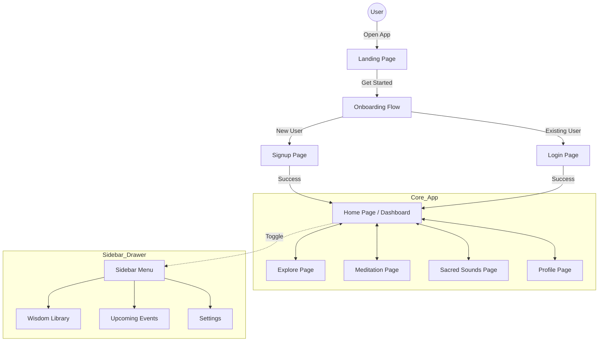

# Ritam - Meditation & Wellness Platform

Ritam is a premium, holistic meditation platform designed to help users elevate their minds and awaken inner serenity. Built with a focus on aesthetics and user experience, it provides a curated collection of meditations, sacred sounds, and wellness tools in a beautiful, immersive interface.

🔗 **Live Demo:** [https://krishi-sevak-a994f.web.app](https://krishi-sevak-a994f.web.app)

## 🌟 Key Features

### 🧘 Core Experiences
- **Home Dashboard**: Personalized greeting (`Ritam`), Daily Streak tracking, Event schedules, and curated Daily Recommendations.
- **Explore Page**: Discover content by "Outcomes" (Stress, Sleep, Focus), engage in Breathwork, or listen to Binaural Beats.
- **Meditation Library**: A dedicated space for guided sessions featuring collections like "Quick Fix" and "De-Stress", with powerful filtering options.
- **Sacred Sounds**: Access ancient Vedic chants and mantras (e.g., Rudram, Devi Kavacham) with specialized audio visualizations.

### 👤 User Profile & Tools
- **Profile Hub**: Track your journey with badges, view detailed statistics, and manage custom playlists.
- **Progress Tracking**: Monitor streaks and meditation minutes.
- **Wellness Tools**: Integrated Timer, Journal ('My Routine'), and 'Gurudev Circle' for community connection.

### 🎨 Modern Design System
- **Aesthetic**: A calming, nature-inspired palette using **Mint, Sage, Steel Blue, and Midnight Blue**.
- **Interface**: Glassmorphism effects, smooth micro-animations, and high-quality typography (Google Fonts).
- **Responsive Layout**: Fully optimized for Mobile, Tablet, and Desktop with a mobile-first approach.
  - **Navigation**: Intuitive Bottom Navigation for mobile and a comprehensive Sidebar Drawer for deeper access.

## 🛠️ Tech Stack

- **Frontend**: [React](https://react.dev/) + [Vite](https://vitejs.dev/)
- **Routing**: React Router DOM
- **Styling**: Vanilla CSS (Variables, Grid, Flexbox, Media Queries)
- **Icons**: [Lucide React](https://lucide.dev/)
- **Deployment**: Firebase Hosting

## �️ Application Architecture



## 🚀 Getting Started

### Prerequisites
- Node.js (v16 or higher)
- npm (Node Package Manager)

### Installation

1. **Clone the repository**
   ```bash
   git clone <repository-url>
   cd Ritam
   ```

2. **Install dependencies**
   ```bash
   npm install
   ```

3. **Run the development server**
   ```bash
   npm run dev
   ```

4. **Build for Production**
   ```bash
   npm run build
   ```

### ☁️ Deployment

The project is configured for Firebase Hosting. You can build and deploy the application in a single step using the custom script:

```bash
# Login to Firebase (First time only)
npx firebase login

# Build and Deploy to live site
npm run deploy-live
```

## 📄 License

This project is licensed under the MIT License.
